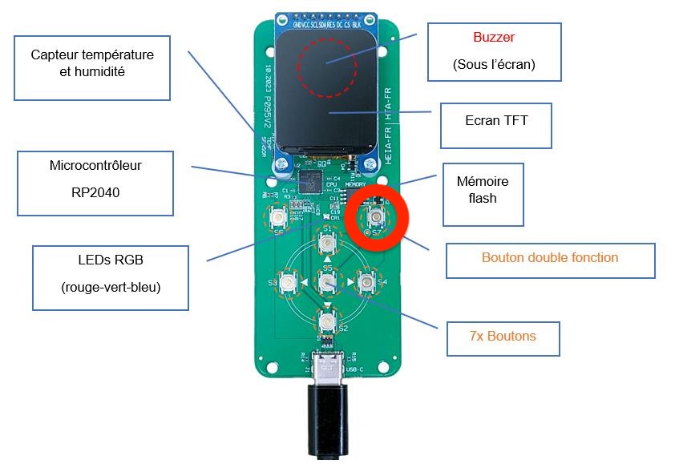
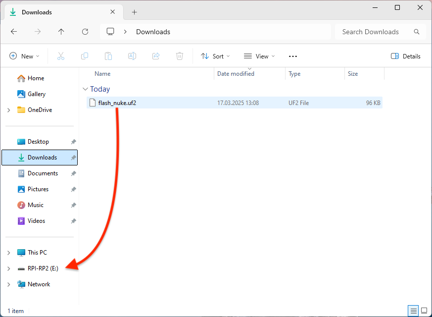
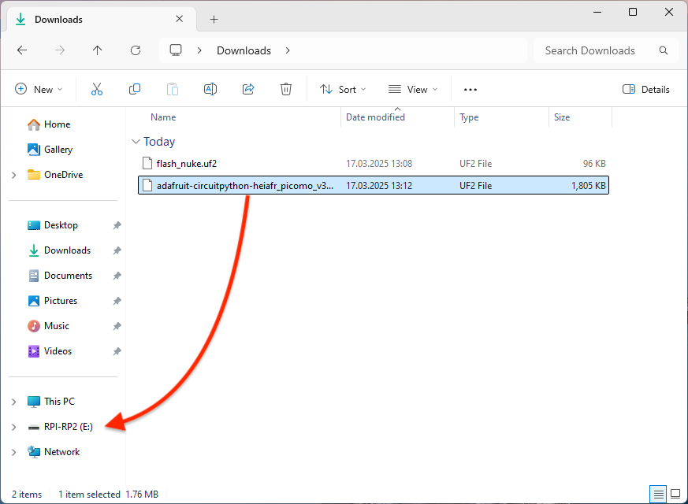
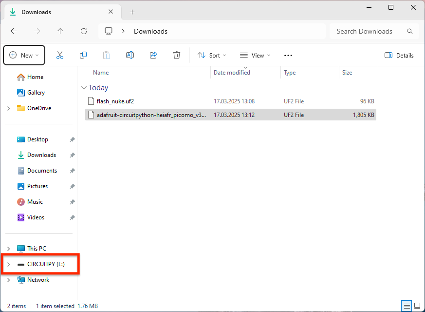
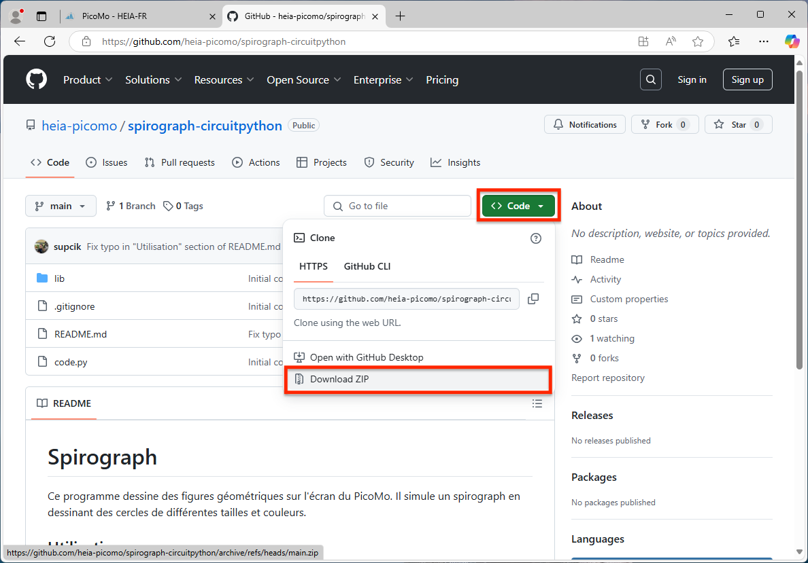
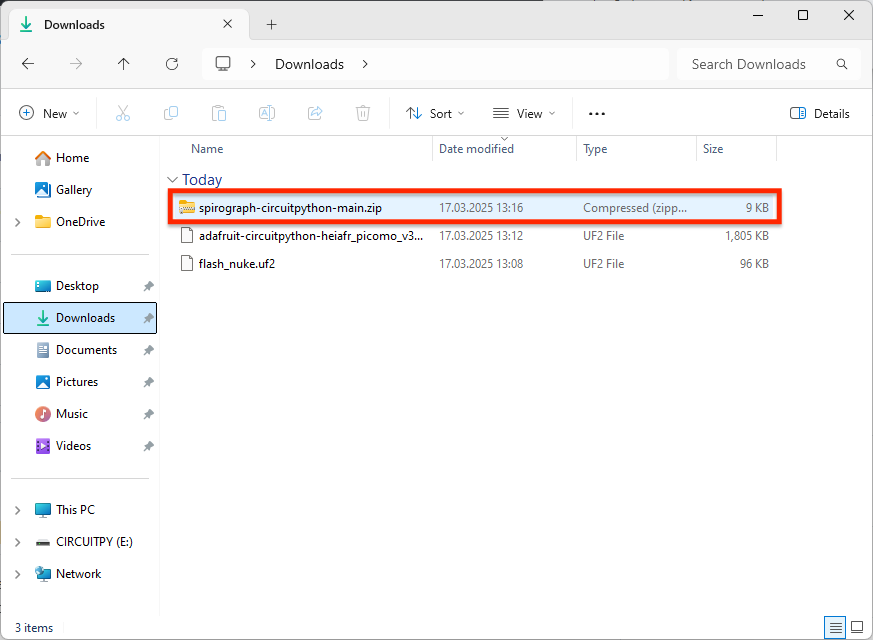
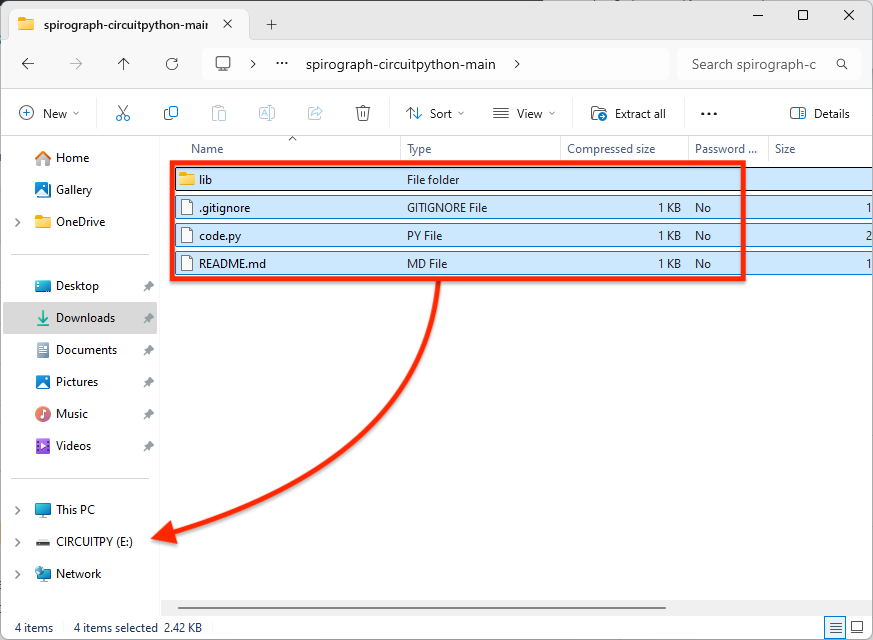
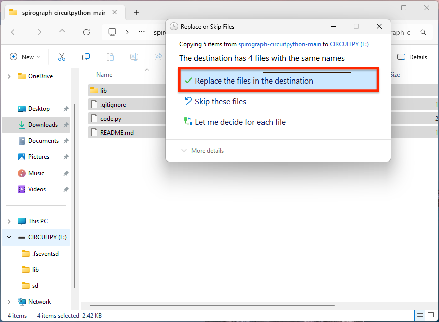

# Spirograph

Ce programme dessine des figures géométriques sur l'écran du PicoMo. Il
simule un spirograph en dessinant des cercles de différentes tailles et
couleurs.

## Installation de Circuit Python

1. Connectez votre PiCoMo en pressant le boutonf S7 (en haut à droite).
   
   
2. Un disque "RPI-RP2" devrait apparaître sur votre ordinateur.
   
   
3. Téléchargez le fichier [flash_nuke.uf2](https://datasheets.raspberrypi.com/soft/flash_nuke.uf2).
4. Glissez-déposez le fichier `flash_nuke.uf2` sur le disque "RPI-RP2".
   
   
5. Votre PiCoMo devrait redémarrer et le disque "RPI-RP2" devrait réapparaître.
6. Rendez-vous sur le site de CircuitPython et téléchargez le code dans la langue de votre choix:
    - [PiCoMo Version 2.0](https://circuitpython.org/board/picomo_v2/)
    - [PiCoMo Version 3.0](https://circuitpython.org/board/picomo_v3/)
7. Glissez-déposez le fichier téléchargé sur le disque "RPI-RP2".
   
   
8. Votre PiCoMo devrait redémarrer en affichant du texte sur l'écran
   et le disque "RPI-RP2" devrait être remplacé par un disque "CIRCUITPY".
   
   

## Installation de l'application

1. Téléchargez ce dépôt (https://github.com/heia-picomo/spirograph-circuitpython) sous la forme de [fichier
   zip](https://github.com/heia-picomo/spirograph-circuitpython/archive/refs/heads/main.zip).
   
   
2. Double-cliquez sur le fichier téléchargé pour le décompresser.

   
3. Ouvrez le dossier `spirograph-circuitpython-main`.
4. Glissez-déposez le contenu du dossier `spirograph-circuitpython-main` sur
   le disque "CIRCUITPY".
   
   
5. L'ordinateur vous demande de remplacer certains fichiers. Acceptez de
   remplacer ces fichiers en cliquant sur "Replace the files in the
   destination" ("Remplacer les fichiers dans la destination" en
   français).

   
